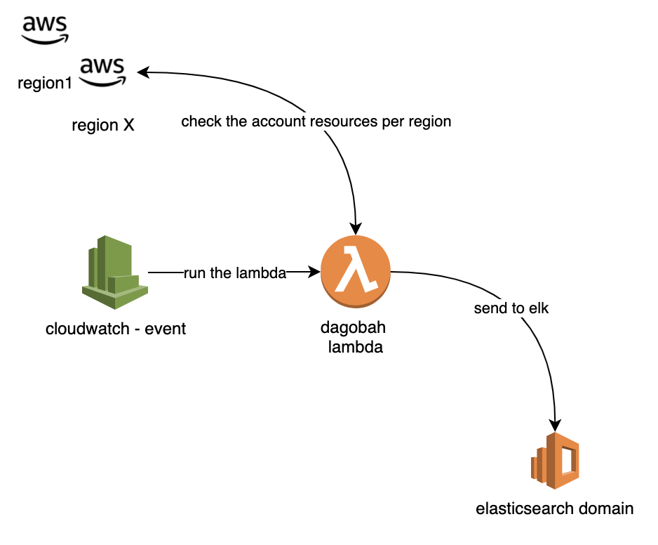

# dagobah the lambda opensource to collect inventory & compliance data from AWS

This python code collect:

* EC2
* VPC
* ENI
* SecurityGroups

From all the regions into the aws account and send it to elasticsearch, to browser and analize the information.